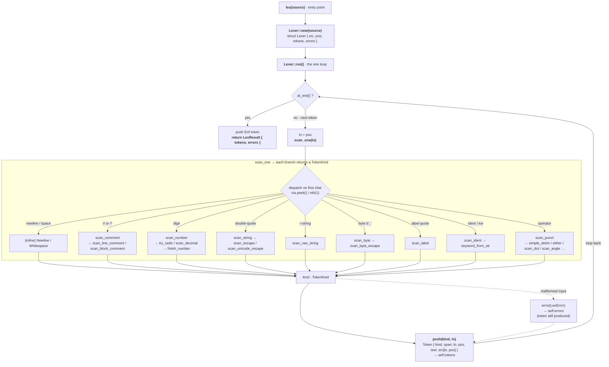

# axiom-lexer

Source text → a **lossless, tiling** stream of `Token`s. The first crate of the
Axiom compiler, built test-first against [`docs/lexer-testing.md`](../../docs/lexer-testing.md)
and the lexical spec in [`DESIGN_SPEC.md`](../../DESIGN_SPEC.md) §2.

Two properties define it:
- **Lossless** — whitespace and comments are real tokens, so the stream alone
  reconstructs the source byte-for-byte (feeds the future formatter).
- **Total** — every input produces a stream that tiles the source. Malformed
  input becomes an `Unknown` token or a best-effort literal; problems are
  reported in `LexResult::errors`, never by failing. This is what lets the
  fuzzer assert the coverage invariants on *every* input.

## How it works (end-to-end flow)

`lex` builds a `Lexer` and runs one loop: each turn captures the start offset,
calls `scan_one` to classify the next token by its first char, then `push`es a
`Token` carrying its exact source slice. Trivia (whitespace/comments) is scanned
into real tokens, not skipped. Errors are pushed to `self.errors` but a token is
**always** produced, so the loop never stalls. At EOF it appends an `Eof` token
and returns `LexResult`.



## Files

| File | Responsibility | Key items |
|---|---|---|
| `src/lib.rs` | Crate root; public API re-exports | `lex`, `serialize`, `check_all`, `Token`, `TokenKind` |
| `src/token.rs` | Plain data — no logic | `Span`, `TokenKind`, `Keyword`, `Punct`, `Token`, `LineMap` |
| `src/symbols.rs` | **Single source of truth** for keyword spellings + display names | `keyword_from_str`, `display_name`, `keyword_label`, `punct_label` |
| `src/lexer.rs` | The scanner — the one stateful core (byte cursor + small `scan_*` methods) | `lex`, `LexResult` |
| `src/snapshot.rs` | Canonical token serializer (pure functions) | `serialize` |
| `src/invariants.rs` | Coverage guarantees, defined once, reused everywhere | `tiles`, `reconstruct`, `spans_match_text`, `check_all` |
| `src/error.rs` | Lexer-stage errors (`thiserror`) | `LexError` |
| `examples/lex.rs` | The debug dump (`cargo run --example lex -- file.ax`) | — |
| `tests/golden.rs` | `*.ax` → `*.tokens` snapshot tests | — |
| `tests/invariants.rs` | Coverage invariants over every fixture | — |
| `tests/diagnostics.rs` | Malformed `*.ax` → `*.stderr` diagnostic snapshots | — |
| `tests/fuzz.rs` | std-only no-panic + tiling fuzz | — |
| `tests/fixtures/` | `.ax` samples + checked-in `.tokens` / `.stderr` goldens | — |

## Invariants & gotchas

- **`symbols` is the only place** a keyword spelling or kind label is written.
  `display_name`/`keyword_label`/`punct_label` are exhaustive matches: adding a
  `Keyword`/`Punct` variant without a label fails to compile. The serializer is
  forbidden from hardcoding labels (`snapshot::tests::test_no_hardcoded_kind_labels`).
- **Byte offset is the single positional truth.** `Span` is a half-open byte
  range; `line:col` is derived via `LineMap` (columns counted in characters).
- **The scanner is the one place mutation lives.** Everything else (serializer,
  invariants, classifiers) is pure. Don't add state outside `lexer.rs`.
- **Maximal munch** subtlety: a `.` continues a float only if a digit follows,
  so `1..5` lexes as `Int DotDot Int`, not `1.` `.5`. See `test_range_is_not_a_float`.
- **LF-only line terminator** (§2.1): `\r` is whitespace, a lone `\r` is not a
  line break. A leading **BOM** (U+FEFF) is treated as whitespace, not an error.
- **A leading `'` is a loop label** (`'outer`, §7.1), never a char literal or
  lifetime (Axiom has neither). `b'A'` is still a byte literal (the `'` follows
  `b`); a lone `'` not followed by an identifier is an `Unknown` token. `?` lexes
  as the `Question` punct (Option-propagation, §6.5).
- **Happy-path fixtures must lex clean.** `tests/golden.rs` asserts zero
  diagnostics for every `fixtures/*.ax`; only `fixtures/errors/*.ax` may produce
  errors. (The tiling invariant proves coverage, not correct classification — so
  this assertion is what catches a token silently mis-lexed as `Unknown`.)

## Commands

```bash
cargo test -p axiom-lexer                          # full suite
UPDATE_SNAPSHOTS=1 cargo test -p axiom-lexer       # regenerate goldens (eyeball the diff!)
cargo run -p axiom-lexer --example lex -- file.ax  # the debug token dump
```

## When you change this crate

- Add a token kind: one `TokenKind`/`Keyword`/`Punct` variant + its label in
  `symbols`. The serializer, invariants, and CLI are data-driven and need no
  changes (`docs/lexer-testing.md` §5.3).
- Add a language construct: add a `tests/fixtures/*.ax` + regenerate its golden,
  and update this table if you add a file.
