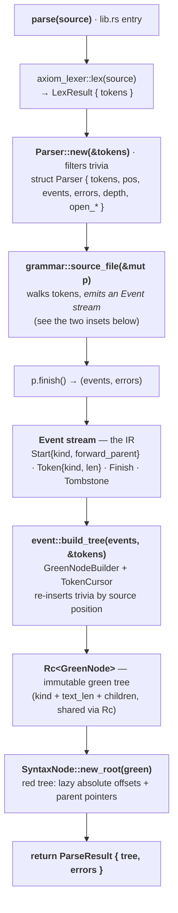
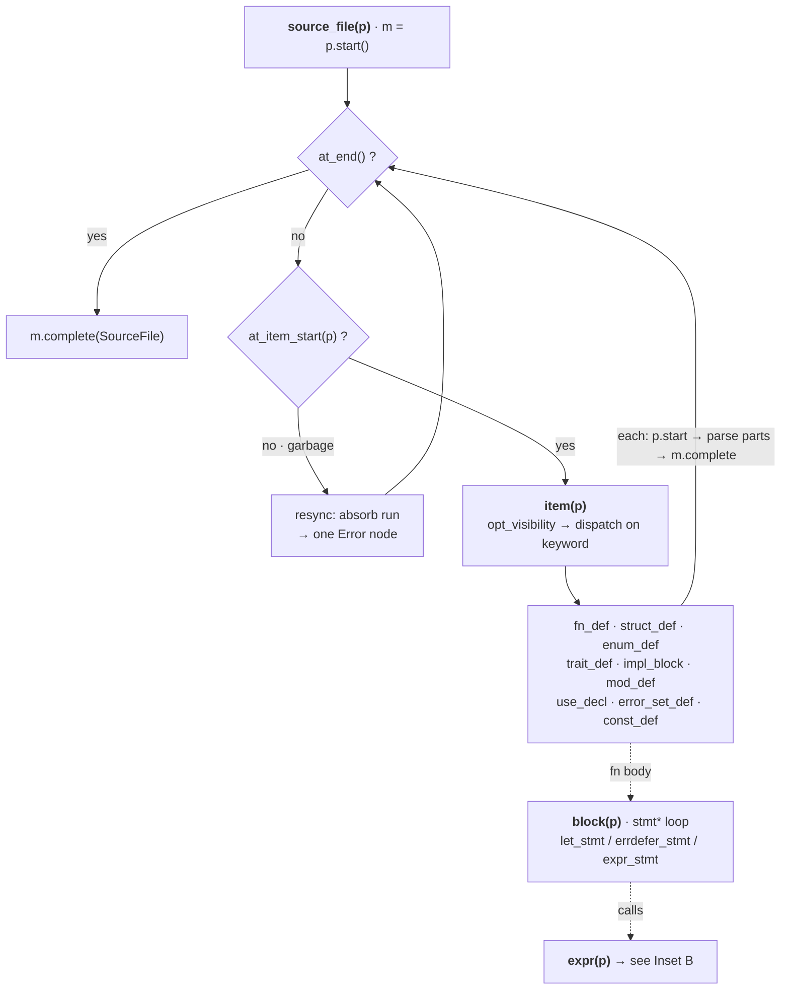
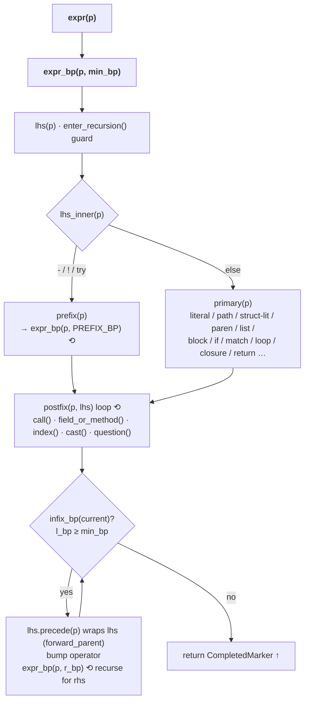

# axiom-parser

The lexer's token stream → a **lossless concrete syntax tree (CST)**. The second
crate of the Axiom compiler, built test-first against
[`docs/parser-testing.md`](../../docs/parser-testing.md) and the grammar in
[`DESIGN_SPEC.md`](../../DESIGN_SPEC.md) §3–§10.

Three properties define it:
- **Lossless** — every token, trivia included, is a tree leaf, so the tree
  reconstructs the source byte-for-byte (`reconstruct(tree) == source`). This is
  the parser's load-bearing "nothing dropped" invariant and the reason we chose a
  CST over a plain AST (it also gives a formatter / precise LSP for free later).
- **Total** — every input yields a tree plus a diagnostics list, never a panic, a
  hang, or a failed `Result`. Malformed input becomes `Error` nodes; the parser
  resynchronizes and continues.
- **rust-analyzer–shaped** — an immutable green tree, a lazy red tree with
  absolute offsets, and (forthcoming) typed AST views — hand-rolled, no `rowan`,
  zero `unsafe`.

## How it works (end-to-end flow)

`parse` is a pipeline. The grammar **never builds the tree** — it walks a
trivia-filtered token cursor (`Parser`) and emits a flat `Event` stream (the IR).
`build_tree` then materializes the immutable green tree from those events,
re-inserting trivia by source position, and `new_root` wraps it as the lazy red
tree. Diagnostics ride alongside in `ParseResult.errors`; the tree is always
present.



**Inset A — the grammar dispatch (how `source_file` drives the loop).** Every
`parse_*` opens a node with `p.start()`, parses its parts, and closes it with
`marker.complete(kind)`; a token that can't begin an item/statement is resynced
into a single `Error` node (see *Recovery* below).



**Inset B — the expression engine (Pratt precedence climbing).** This is the
recursive cycle and where the "return back" happens: `lhs` parses a prefix/primary
with postfix trailers, then the climb loop repeatedly `precede()`s the current
`lhs` into an operator node and recurses for the right side, returning a
`CompletedMarker` up the chain. `enter_recursion()` (`MAX_DEPTH = 64`) guards it.



> **Marker → Event mechanics:** `p.start()` pushes a `Tombstone` and returns a
> `Marker`; `p.bump()` pushes `Token{kind,len}`; `Marker::complete(kind)` rewrites
> the `Tombstone` into `Start{kind}` and pushes `Finish`; `CompletedMarker::precede()`
> sets the earlier `Start`'s `forward_parent` so `build_tree` opens the wrapping
> node first — that is how left-associativity (`a + b + c`) is encoded without
> backtracking.

## Files

| File | Responsibility | Key items |
|---|---|---|
| `src/lib.rs` | Crate root; public API + `parse` entry | `parse`, `ParseResult`, `serialize`, `check_all` |
| `src/syntax_kind.rs` | **Single source of truth**: one flat `SyntaxKind` (token+node) + labels + lexer bridge | `SyntaxKind`, `from_lexer`, `is_keyword` |
| `src/green.rs` | Immutable green tree + builder | `GreenNode`, `GreenToken`, `GreenNodeBuilder` |
| `src/syntax.rs` | Lazy red tree (offsets + parents) | `SyntaxNode`, `SyntaxToken`, `SyntaxElement` |
| `src/event.rs` | Parser events + `build_tree` (events + tokens → green tree, trivia re-inserted) | `Event`, `build_tree` |
| `src/parser.rs` | The cursor over significant tokens: markers, recovery, depth guard (stateful core) | `Parser`, `Marker`, `CompletedMarker` |
| `src/grammar/mod.rs` | Grammar entry (`source_file`) + shared `path` helper | `source_file`, `path` |
| `src/grammar/expr.rs` | Pratt expression parser (§2.7 precedence) | `expr`, `infix_bp` |
| `src/grammar/stmt.rs` | Blocks + statements (`val`/`var`/`errdefer`/expr-stmt) | `block` |
| `src/grammar/item.rs` | Items: fn/struct/enum/trait/impl/mod/use/error/const | `item` |
| `src/grammar/ty.rs` | Type annotations (paths, generics, error-union `!`) | `ty` |
| `src/grammar/pattern.rs` | Match-arm + destructure patterns | `pattern` |
| `src/ast/mod.rs` | Typed AST views hub: `AstNode` trait, shared navigation helpers + kind classifiers, and re-exports of every view (one struct per node kind) | `AstNode`, `FnDef`, `StructDef`, `LetStmt`, … |
| `src/ast/{item,item_part,stmt,expr,expr_flow,expr_part,name,pattern,ty}.rs` | The views themselves, grouped by family; `src/ast/tests.rs` holds the consistency guard + per-view tests | one struct per node kind |
| `src/snapshot.rs` | Canonical tree serializer (pure) | `serialize` |
| `src/invariants.rs` | Coverage guarantees, defined once, reused everywhere | `reconstruct`, `spans_well_formed`, `every_token_present`, `check_all` |
| `src/error.rs` | Parse-stage diagnostics (`thiserror`) | `ParseError` |
| `examples/parse.rs` | Debug tree dump (`cargo run --example parse -- file.ax`) | — |
| `tests/golden.rs` | `*.ax` → `*.ast` snapshot tests | — |
| `tests/invariants.rs` | Coverage invariants over every fixture | — |
| `tests/diagnostics.rs` | Malformed `*.ax` → `*.stderr` diagnostic snapshots | — |
| `tests/fuzz.rs` | std-only no-panic + termination + round-trip fuzz | — |
| `tests/fixtures/` | `.ax` samples + checked-in `.ast` / `.stderr` goldens | — |

## Invariants & gotchas

- **`SyntaxKind` is the only place** a kind label lives. The enum, its `ALL`
  list, `label`, and the `is_trivia`/`is_keyword`/`is_token` predicates are all
  generated from one grouped list by the `syntax_kinds!` macro — adding a variant
  can't drift. Labels are the variant name (`stringify!`), so there are **no**
  label string literals to get wrong. `from_lexer` is the single bridge from the
  lexer's `TokenKind`.
- **The grammar never builds the tree.** It emits `Event`s; `event::build_tree`
  materializes the green tree and re-inserts trivia. Trivia attaches as **leading
  trivia of the following significant token**, owned by whatever node is open
  when that token is consumed (the deterministic rule in `docs/parser-testing.md`
  §3). `Eof` is never a tree leaf.
- **Byte offset is the single positional truth** (same as the lexer). Green nodes
  carry length; red nodes derive absolute offsets by accumulation.
- **Termination** is structural: every grammar loop bumps or breaks, and
  the error-recovery primitives always either consume a token or break a
  non-comma loop on no progress. A recursion-depth guard (`MAX_DEPTH`)
  turns pathologically nested input into recovery instead of a stack overflow —
  it covers **every** recursive grammar path: expressions (`lhs`), blocks
  (`block`), types (`ty`), patterns (`pattern`), and use-trees (`use_tree`).
- **Recovery is recovery-set–aware and resynchronizing.** Two layers:
  - *Leaf positions* (a missing expression / pattern / type / member) use
    `err_recover`: it reports the error but leaves a *claimed* closing delimiter
    — one an enclosing `(`/`[`/`{` is still waiting for — in place so its owner
    can consume it, instead of absorbing it as an `Error` token. The open-bracket
    counts are maintained centrally in `Parser::bump`; a genuinely stray closer
    (no matching opener) is still absorbed.
  - *List positions* (statements, items, members) use `recover_to(msg, is_sync)`:
    it reports **once** and absorbs the whole run of unexpected tokens into a
    **single** `Error` node, stopping before the next element start (`is_sync` —
    e.g. `stmt::at_stmt_start`, `item::at_item_start`), a claimed closer, or EOF.
    This resyncs to the next statement/item instead of emitting one diagnostic per
    junk token.
  - *Totality backstop:* `grammar::source_file` is the **outermost** loop and is
    unconditionally total — it never honors `at_claimed_close` (the global
    open-bracket counts can leak when a malformed item consumes an opener but
    recovers before its closer; at file scope no construct owns such a closer), so
    it always consumes every token to EOF. `err_and_bump` (the unconditional
    single-token consume) is still used where exactly one token must be dropped.
- **Dropping the tree is iterative** — both `green::GreenNode`'s `Drop` and the
  red `syntax::SyntaxNode` parent-chain `Drop` — so a degenerate deep tree (long
  operator chain, deep recovery subtree) never overflows the stack when freed.
- **The red-tree consumers are iterative.** `invariants::check_all`, the
  snapshot serializer, and `syntax::collect_tokens` walk the tree with an
  explicit work-stack, so even a pathologically deep valid tree (a long
  iteratively-built operator chain) is serialized/checked without stack
  proportional to depth.
- **Happy-path fixtures must parse clean.** `tests/golden.rs` asserts zero
  diagnostics for every `fixtures/*.ax`; only `fixtures/errors/*.ax` may produce
  errors. The coverage invariants still hold on the error fixtures (recovery
  never drops source).

## Known limitations (v1 boundaries, deliberately deferred)

These are documented gaps, not bugs — each is a small, isolated follow-up.
(Resolved since the first cut: the `?` Option-postfix token, `>>` nested-generic
closing via parser-side token splitting, `'label` loop labels, the recursion
guard now covering types/patterns/use-trees, iterative green-tree `Drop`,
iterative red-tree consumers, a kind- and split-aware `every_token_present`,
recovery-set–aware leaf recovery, and — most recently — **rich resynchronizing
recovery**: statement/item/member lists resync to the next element start, so a
garbage run collapses into one `Error` node with one diagnostic instead of a
per-token cascade.)

- **Match-arm recovery is still single-token.** Statement, item, and member lists
  resync (`recover_to`); match arms still use leaf recovery (`err_recover`),
  which is adequate because arms are `,`/`=>`-delimited so cascades are naturally
  bounded. Threading a pattern first-set through a `recover_to` at the arm loop is
  the small remaining extension.
- **`MAX_DEPTH = 64` is conservative.** It bounds genuine grammar *recursion*
  (nested parens/if/match/types), not iterative postfix chains, so real code is
  unaffected; raising it needs a correspondingly larger stack.

## Commands

```bash
cargo test -p axiom-parser                            # full suite
UPDATE_SNAPSHOTS=1 cargo test -p axiom-parser         # regenerate *.ast / *.stderr (eyeball the diff!)
cargo run -p axiom-parser --example parse -- file.ax  # the debug tree dump
```

## When you change this crate

- Add a node/token kind: one `SyntaxKind` variant in the right macro group. The
  serializer, invariants, and CLI are data-driven and need no changes. **Also add
  a view in the matching `src/ast/<family>.rs`** and register it in the test-only
  `can_cast_any` (in `src/ast/tests.rs`) — `test_ast_every_node_kind_covered`
  will fail until you do.
- Add a grammar construct: a small `parse_*` function (keep loops bump-or-break),
  plus a `tests/fixtures/*.ax` + regenerated golden. Update this table if you add
  a file.
